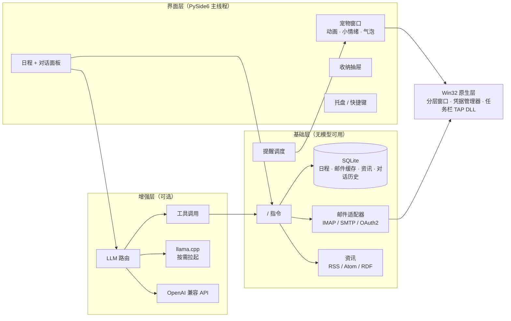

# 小银 · 桌面宠物助理

> 坐在 Windows 11 任务栏上的猫娘桌面宠物，同时是一个轻量的个人助理：日程提醒、桌面收纳、邮件、资讯订阅。
> 本地大模型按需加载，平时零占用；**没有大模型也是一个完整可用的助理**。

<p align="center">
  
</p>


---

## 产品亮点

| | |
|---|---|
| 🐱 **真正"坐"在任务栏上** | 宠物骑在任务栏上沿，腿垂在任务栏前面；只有人物像素可点击，其余区域鼠标穿透；全屏游戏/视频时自动让开 |
| ✨ **有生命感的小动作** | 呼吸、尾巴摆动、眨眼、晃脚；长时间没动键鼠会睡着（闭眼 + 头顶飘 Z）；在她头上来回蹭 = 摸头（脸红 + 爱心）；可以被拎起来、自己下来走动、跳上窗口顶边坐着 |
| 📅 **日程规划与提醒** | 点宠物弹出"日程 + 对话"面板：周视图、倒计时、一句话快速添加（`明天下午3点 组会 提前30分钟`）；重复日程（每天/工作日/每周）、到点气泡提醒（完成 / 10 分钟后再提醒）+ 系统通知 |
| 🗄️ **桌面收纳抽屉** | 屏幕顶端的把手可以像真抽屉一样拉出来（跟手拖动、甩动、弹簧回弹）；自建分类、拖拽归类、所有操作可撤销；**从不移动你的文件**，分类只是标签 |
| ✉️ **多账户邮件** | QQ / 163 / 126 / Gmail / Outlook / Office 365 / iCloud 等 IMAP/SMTP；授权码只存 Windows 凭据管理器；**发信两步制**，模型只能起草，必须用户确认才会发出 |
| 📰 **资讯订阅** | RSS / Atom / RDF，输入网址自动发现订阅源，去重入库；接入模型后生成中文摘要 |
| 🧹 **桌面完全干净** | 一键隐藏桌面图标、任务栏自动隐藏/完全隐藏，退出时恢复原样；可选全透明任务栏 |
| 🤖 **可插拔大模型（可选）** | 本地 llama.cpp + Qwen3-4B 按需拉起、空闲 5 分钟自动退出；或任意 OpenAI 兼容 API。模型能通过工具调用操作日程/邮件/资讯 |

### 设计原则：功能分层

| 层 | 功能 | 依赖 |
|---|---|---|
| **基础层**（始终可用） | 宠物与全部动效、日程与提醒、收纳抽屉、邮件收发、资讯抓取、全部 `/` 指令、托盘菜单 | 无 |
| **增强层**（接入模型后） | 自由聊天（傲娇人设）、自然语言记日程、起草邮件、资讯摘要 | 本地模型或 OpenAI 兼容 API |

模型不可用时，聊天会明确提示并引导使用 `/` 指令，基础层不受任何影响。

---

## 技术要点

**1. 无闪烁的桌面宠物渲染**
- 每一帧预合成为整图，整只宠物只用**一个原生分层窗口**（ctypes 直调 Win32），每帧一次 `UpdateLayeredWindow` 同时提交位置和内容，杜绝多窗口拼接时的接缝与错帧。
- Win11 任务栏是 DirectComposition 内容层，普通置顶窗口点一下任务栏就会被盖住 1~2 帧。这里把宠物窗口的**所有者设为任务栏**（被拥有的窗口永远在所有者之上），真机抓帧 849 帧 0 帧被遮挡。
- 跨线程所有者关系会把输入队列与 explorer 绑定，因此窗口放在**独立线程**，只做收帧、提交与鼠标转发；Qt 主线程只投递消息、从不等待。
- 按 alpha 通道做像素级命中测试，透明区域鼠标穿透；explorer 重启后自动找回新任务栏并重建窗口。

**2. 程序化动画**
- 在家坐姿循环由切层素材（身体 / 尾巴 / 闭眼差分）离线烘焙：呼吸 × 尾摆 × 晃脚的最小公倍周期，启动时发现缺帧自动在后台烘焙。
- 晃脚：把翘着的脚掌单独抠成一层，沿小腿轴线用 smoothstep 权重做**连续网格形变**（Pillow MESH，预乘 alpha 重采样），没有切口、没有鬼影。
- 行为状态机（在家 / 睡觉 / 摸头 / 提醒 / 站起 / 走 / 跳 / 坐窗口边 / 被拎起 / 回家）为纯逻辑，单独可测。

**3. 抽屉的物理手感**
- 阻尼弹簧用**解析解**逐帧求值（与帧率无关、不会发散），打开 ζ=0.9、收起 ζ=1；越界使用橡皮筋函数；松手速度直接作为弹簧初速度，并按投射终点决定停靠位置。
- Qt 在 Windows 上的定时器精度约 15.6ms，高刷屏会卡顿；动画期间改由后台线程按 `DwmFlush`（显示器合成节奏）唤醒主线程。
- 拖放一律使用 Link/Copy 语义，保证不会误删或误移用户桌面上的文件。

**4. 系统集成**
- 全透明任务栏：Win11 任务栏由 XAML 绘制，外部进程改不了；用 C 从零写了一个 XAML 诊断接口 TAP DLL（`native/taskbar_tap/tap.c`，Zig 交叉编译），注入 explorer 修改任务栏背景画刷，并记录原画刷以便完整还原。
- 邮件凭据通过 ctypes 直调 `advapi32` 存入 Windows 凭据管理器，不落盘、不进配置文件；Outlook/Office 365 支持 OAuth2 设备码登录并自动续期。
- 全局快捷键、单实例锁、系统托盘、任务栏显隐、桌面图标开关全部基于原生 Win32 API。

**5. 大模型接入**
- `config/llm.json` 可插拔：本地 llama.cpp 子进程**按需拉起、闲置自动退出**，或任意 OpenAI 兼容接口，改配置即可切换。
- 工具调用（function calling）复用基础层代码：`add_event` / `list_events` / `complete_event` / `delete_event` / `list_mail` / `read_mail` / `draft_mail` / `list_news` 等；**模型没有发信工具**，安全边界在架构上保证。
- 耗时的模型调用绝不放在数据库写事务中，避免多线程下 SQLite 锁库。

**6. 工程质量**
- 约 1.4 万行 Python + 3.5 千行测试；**284 项单元测试**，GitHub Actions 在 `windows-latest` 上运行。
- 所有改动系统外观的调用都集中在可替换的接口层，测试和 CI 一律使用假接口，**绝不在真实系统上执行**；测试数据库与凭据全部隔离在临时目录/内存中。
- 依赖只有 PySide6 与 Pillow，其余全部使用标准库；邮件、资讯模块懒加载，空闲时占用很低。

---

## 架构



---

## 快速开始

环境要求：**Windows 11**，Python 3.12。

```powershell
git clone https://github.com/wastonD/desktop-assistant-demo.git
cd desktop-assistant-demo
python -m venv .venv
.venv\Scripts\pip install -r requirements.txt
.venv\Scripts\pythonw -m app.main
```

首次启动会在后台烘焙宠物动画帧（几秒钟）。单实例运行，重复启动不会开出第二只。

### 接入大模型（可选）

编辑 `config/llm.json` 的 `provider`：

- **本地模型**（默认 `local`）：把 [llama.cpp](https://github.com/ggml-org/llama.cpp/releases) 的 Windows 版解压到 `llama_cpp/`，把 GGUF 模型（如 `Qwen3-4B-Instruct-2507-Q4_K_M.gguf`）放到 `models/`。聊天时自动拉起，空闲 5 分钟自动退出。
- **OpenAI 兼容 API**：在 `providers` 中填写 `base_url`、`model`，API Key 通过 `api_key_env` 指定的环境变量（或项目根目录的 `.env`）提供，不写进配置文件。

人设在 `config/persona.txt`，可以随意修改。

### 邮箱

托盘菜单「邮箱账户…」添加账户。各邮箱如何获取授权码、如何配置 OAuth，见 [docs/MAIL.md](docs/MAIL.md)。

---

## 使用

**鼠标**
- 单击宠物 / 单击托盘图标：打开日程 + 对话面板
- 在她头上来回蹭：摸头；拖住往上提：拎起来（松手会掉下去）
- 右键宠物：菜单（出去走走 / 回家、活泼度、桌面干净……）

**快捷键**

| 快捷键 | 作用 |
|---|---|
| `Ctrl+Alt+X` | 打开 / 收起日程 + 对话面板 |
| `Ctrl+Alt+D` | 拉开 / 收起桌面收纳抽屉 |
| `Ctrl+Z`（抽屉内） | 撤销上一步 |
| `Ctrl+Alt+T` | 任务栏"完全隐藏"时临时呼出 |

**常用指令**（对话框输入 `/` 有补全）

| 指令 | 示例 |
|---|---|
| `/今天` | 今日安排 + 空闲时段 + 逾期未完成 |
| `/记` | `/记 明天下午3点 组会 提前30分钟`、`/记 每天 8:00 背单词` |
| `/日程` | `/日程 站会 2026-10-08 09:30 15 工作日`（15 分钟前提醒，工作日重复） |
| `/完成` `/删除` `/稍后` | 按编号操作日程 |
| `/邮件` | `/邮件 刷新`、`/邮件 看 1`、`/邮件 搜 发票` |
| `/回复` `/发送` | 生成回复草稿；确认后 `/发送 编号` 才真正发出 |
| `/资讯` | `/资讯 订阅 https://sspai.com`、`/资讯 源` |
| `/收纳` | 打开收纳抽屉 |
| `/帮助` | 全部指令 |

---

## 目录结构

```
app/
├── main.py            入口：托盘、快捷键、调度
├── pet_window.py      宠物窗口（三窗口实现，默认引擎）
├── pet2/              宠物 v2：整帧 + 单个原生分层窗口（config/pet.json 设 "engine": "v2" 启用）
├── pet_fx.py          小情绪：睡觉、摸头、提醒、思考
├── foot_swing.py      晃脚网格形变
├── hub.py             日程 + 对话面板（agenda_view + chat_panel）
├── agenda.py          日程规划：下一个、逾期、空闲时段
├── quickadd.py        一句话日程解析
├── store.py           SQLite 存储
├── commands.py        / 指令
├── llm.py / tools.py  可插拔大模型与工具调用
├── drawer/            收纳抽屉（core 纯逻辑 / motion 弹簧物理 / window 界面）
├── mail/              多账户邮件（IMAP/SMTP、OAuth2、凭据管理器）
├── news/              资讯（抓取、解析、自动发现、OPML）
├── desktop_clean.py   桌面图标 / 任务栏显隐
└── taskbar_style.py   任务栏外观（透明 / 模糊 / 亚克力）
native/taskbar_tap/    透明任务栏 TAP DLL 源码（C）
assets/character/      角色素材 = 换装接口（pet.png + 分层 + character.json）
tests/                 单元测试
tools/                 动画烘焙、DLL 编译脚本
```

## 测试

```powershell
.venv\Scripts\python -m unittest discover tests
```

测试不联网、不改动系统设置、不读取真实数据，约 6 秒跑完。

## 许可

代码以 [MIT License](LICENSE) 开源。角色立绘为本项目原创的 AI 生成素材，仅供本项目演示使用。
